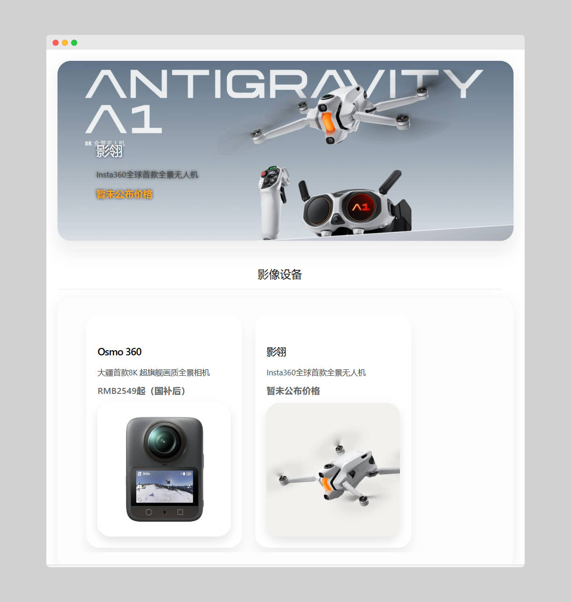

# Goods Exhibition

一个用于快速搭建「好物推荐展示页」的 WordPress 插件，通过短代码即可在任意页面展示整洁的商品列表，适合个人博客、电商导购、团队推荐页等场景。

---

## 功能特性

- ✅ 在一个页面集中展示多个商品信息  
- ✅ 支持商品名称、图片、简介、链接按钮等展示  
- ✅ 使用短代码一键插入页面或文章  
- ✅ 前端展示样式简洁，方便二次设计  
- ✅ 基于 WordPress 插件机制，安装即可使用  

---

## 环境要求

- WordPress（建议 5.x 或更高版本）  
- PHP 7.0+（推荐 7.2 及以上）  
- 拥有插件安装权限的 WP 后台账户  

---

## 安装教程

### 方法一：WordPress 后台上传（推荐）

1. 下载插件 ZIP 文件  
2. 登录 WordPress 后台  
3. 前往 **插件 → 安装插件 → 上传插件**  
4. 上传 ZIP 文件并安装  
5. 点击 **启用插件**  

---

### 方法二：手动上传到服务器

将 `goods_exhibition` 文件夹上传到：

```
wp-content/plugins/
```

然后：

1. 登录 WordPress 后台  
2. 前往 **插件** 页面  
3. 找到 **Goods Exhibition** 并点击 **启用**  

---

## 快速开始

1. 新建一个 WordPress 页面（例如：`好物推荐`）  
2. 在页面内容中插入短代码：

```
[goods_exhibition]
```

3. 发布页面  
4. 打开页面即可查看商品展示效果  

---

## 短代码说明

当前插件提供以下短代码：

```
[goods_exhibition]
```

- 可用于任意文章或页面  
- 如需参数扩展（例如分类过滤、数量限制等），可在源码中进一步开发  

---

## 界面预览




---

## 项目结构

```text
goods_exhibition/
├─ goods-exhibition.php           # 插件入口，注册插件与短代码
├─ admin/                         # 后台功能模块
├─ assets/                        # 前端静态资源（CSS/JS/图片）
├─ includes/                      # 逻辑模块
├─ templates/                     # 商品展示模板
└─ screenshot-preview-pc-goods.png# 预览图
```

---

## 开发与自定义指南

你可以通过以下方式扩展插件：

- 修改 `assets/` 下的 CSS/JS 以改变样式  
- 自定义 `templates/` 中的布局与字段展示  
- 在 `includes/` 内添加更多逻辑（后台管理、自定义字段等）  
- 在 `goods-exhibition.php` 注册更多钩子或短代码  

> 建议修改前为项目创建新的分支或备份。

---


## 许可证（License）

如仓库包含 `LICENSE` 文件，请遵循对应协议。  
若未包含，请在商用前联系作者确认授权。

---

## 反馈与贡献

欢迎你参与改进插件：

- 提交 Issue 反馈问题  
- 提交 Pull Request 增强功能  
- Fork 项目进行二次开发  
---

如果这个插件对你有帮助，欢迎点一个 ⭐ 支持作者！
