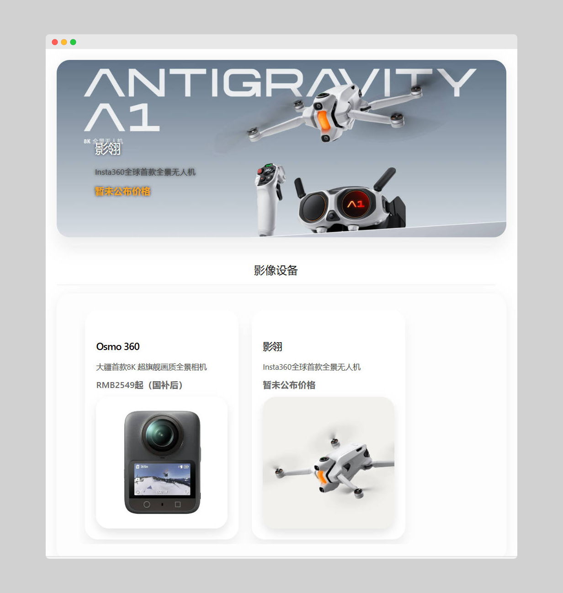

# Goods Exhibition - 好物页面插件

一个用于快速搭建「好物推荐展示页」的 WordPress 插件，通过短代码即可在任意页面展示整洁的商品列表，适合个人博客、电商导购、团队推荐页等场景。

---

## 功能特性

### 前端展示
- Apple 风格卡片式商品展示，支持横向滚动浏览
- 海报幻灯片轮播（自动播放 + 圆点指示器 + 箭头导航）
- 按分类分组展示，支持自定义排序
- NEW 标签标记新品
- 点击卡片跳转外链，底部「了解更多」提示
- 响应式设计（桌面 3 列 / 平板 2 列 / 手机 1.5 列）
- 移动端滑动暗示动画（Peek Animation）
- 夜间模式 / Dark Mode 完整适配
- 图片懒加载 + 首屏海报优先加载（fetchpriority）
- 无 jQuery 依赖，纯 Vanilla JS

### 后台管理
- Tab 式管理面板（产品列表 / 添加新产品 / 分类管理）
- 产品搜索 + 按类别筛选
- 批量删除 / 批量移动至分类
- 拖动排序（筛选分类后可用，前端同步显示）
- 分类管理：添加、编辑、删除、排序
- 媒体库图片选择 + 直接上传
- 表单必填项验证（前端 + 后端双重校验）
- 海报图片自动裁切铺满（16:6 固定比例容器）
- 删除产品时自动清理媒体库孤儿图片（七重引用检查，可选关闭）

### 安全与性能
- Nonce 验证 + 权限检查
- 输入消毒 + MIME 类型验证
- Prepared Statements 防 SQL 注入
- 安全文件删除（路径遍历防护）
- Transient 缓存（12 小时自动刷新）
- 卸载时完整清理（uninstall.php）

### 页面预览


---

## 环境要求

- WordPress 5.0+
- PHP 7.4+
- MySQL 5.6+

---

## 安装

### 方法一：后台上传（推荐）

1. 下载插件 ZIP 文件
2. 登录 WordPress 后台
3. 前往 **插件 - 安装插件 - 上传插件**
4. 上传 ZIP 文件并安装
5. 点击 **启用插件**

### 方法二：手动上传

将 `goods_exhibition` 文件夹上传到 `wp-content/plugins/`，然后在后台启用。

---

## 使用方法

1. 在后台「好物页面 - 分类管理」中创建分类
2. 在「添加新产品」中填写产品信息
3. 新建 WordPress 页面，插入短代码：

```
[goods_exhibition]
```

4. 可选参数限制显示数量：

```
[goods_exhibition limit="10"]
```

---

## 后台管理

### 产品列表
- 搜索：按名称或描述模糊搜索
- 筛选：按类别下拉筛选
- 批量操作：批量删除、批量移动分类
- 拖动排序：筛选指定分类后，拖动行调整顺序

### 添加新产品
- 必填项：产品名称、描述、类别、图片
- 可选项：价格、跳转链接、NEW 标记、海报标记

### 分类管理
- 添加新分类（名称 + 排序权重）
- 编辑分类名称（自动同步产品数据）
- 删除空分类（有产品时禁止删除）

---

## 推荐图片尺寸

| 类型 | 推荐尺寸 | 说明 |
|------|----------|------|
| 产品图片 | 720x720px | 1:1 正方形，自动裁切铺满 |
| 海报图片 | 1920x720px | 16:6 比例，自动裁切铺满 |

---

## 项目结构

```
goods_exhibition/
├── goods-exhibition.php        # 插件入口
├── uninstall.php               # 卸载清理
├── admin/
│   └── admin.php               # 后台管理界面
├── assets/
│   ├── css/
│   │   ├── admin.css           # 后台样式
│   │   └── style.css           # 前端样式（含 Dark Mode）
│   └── js/
│       ├── admin.js            # 后台脚本
│       └── script.js           # 前端脚本（Vanilla JS）
├── includes/
│   ├── functions.php           # 辅助函数
│   ├── image-helpers.php       # 图片上传处理
│   └── shortcode.php           # 短代码渲染
└── README.md
```

---

## 更新日志

### v1.4.9
- 新增：删除产品时自动清理媒体库孤儿图片
- 修复：移动端海报文字块偏高的隐蔽 CSS 特异性问题
- 调整：海报比例统一设置为16:6

### v1.4.6
- 视觉优化：NEW 标签由内嵌 SVG 红色胶囊改为 HTML 渐变小胶囊
- 视觉优化：调小商品卡片阴影
- 修复：商品卡片阴影被滑动容器 overflow 垂直裁切
- 修复：部分主题下分类标题下方出现一条实线

### v1.4.2
- 前端视觉：分类标题两侧增加渐隐细线装饰
- 后台体验：添加产品成功后自动跳转到产品列表，即时确认新商品落位；编辑产品保存后仍停留在编辑页
- 【重要】上传图片改为存储在 `wp-content/uploads/goods-exhibition/`，避免插件更新时目录被替换导致图片丢失（升级时自动迁移旧图片并更新数据库链接）
- 新增升级例程：插件通过后台自动更新后，自动补齐数据表结构与索引，无需手动停用/重新激活
- 修复卸载时 transient 缓存清理不彻底的问题
- 性能：拖动排序保存改为单条 CASE WHEN 批量 SQL，不再逐行 UPDATE
- 性能：批量删除改为单条 DELETE + 整批仅清理一次缓存
- 性能：上传超大图片自动等比缩小并按质量 82 压缩；后台列表缩略图增加懒加载
- 修复：后台 JS 表单验证选择器过宽导致非产品表单页面抛出 JS 错误
- 修复：后台增删改改为 PRG 模式，浏览器刷新不再重复提交表单/重复添加产品
- 清理无调用的死代码

### v1.3.2
- 修复激活流程执行顺序：dbDelta 建表提前，消除首次激活的 SQL 报错
- 上传目录新增 `.htaccess` 保护（禁止脚本执行与目录浏览）
- AJAX 端点输入前置清洗（intval），批量移动校验目标分类真实存在
- 产品列表筛选分类数据源改为分类表，新增未关联产品的分类也能正确显示
- 缓存清理由暴力循环改为版本号机制，解决 limit>100 时缓存失效问题
- 修复激活时 dbDelta 未定义导致的致命错误

### v1.3.1
- 新增夜间模式完整适配
- 新增批量移动至分类功能
- 新增拖动排序（筛选分类后可用）
- 前端同步按排序展示

---

## 许可证

GPL v2 or later

---

## 反馈与贡献

- 提交 Issue 反馈问题
- 提交 Pull Request 增强功能
- Fork 项目进行二次开发

如果这个插件对你有帮助，欢迎点一个 Star 支持作者！
